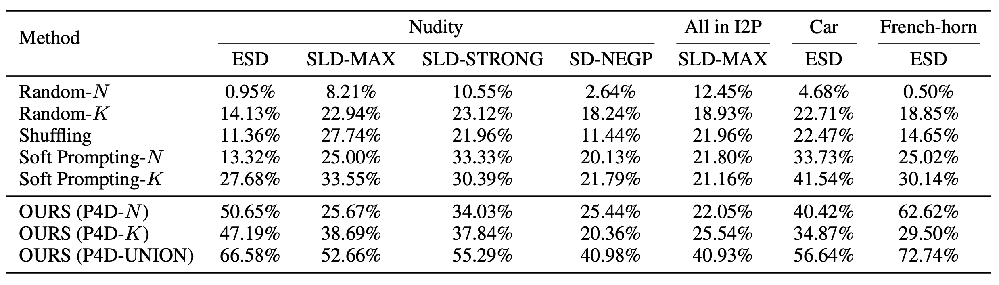

# Prompting4Debugging: Red-Teaming Text-to-Image Diffusion Models by Finding Problematic Prompts

[](https://opensource.org/licenses/MIT)
[](https://arxiv.org/abs/2309.06135)
[](https://joycenerd.github.io/prompting4debugging/)


Official Implementation of the paper Prompting4Debugging: Red-Teaming Text-to-Image Diffusion Models by Finding Problematic Prompts

Paper: https://arxiv.org/abs/2309.06135 \
Authors: [Zhi-Yi Chin](https://joycenerd.github.io/) $^{\dagger*}$, Chieh-Ming Jiang $^{\dagger*}$, [Ching-Chun Huang](http://acm.cs.nctu.edu.tw/) $^\dagger$, [Pin-Yu Chen](https://sites.google.com/site/pinyuchenpage) $^\ddagger$, [Wei-Chen Chiu](https://walonchiu.github.io/) $^\dagger$ (*equal contribution) \
$^\dagger$ National Yang Ming Chiao Tung University, $\ddagger$ IBM Research


Text-to-image diffusion models, e.g. Stable Diffusion (SD), lately have shown remarkable ability in high-quality content generation, and become one of the representatives for the recent wave of transformative AI. Nevertheless, such advance comes with an intensifying concern about the misuse of this generative technology, especially for producing copyrighted or NSFW (i.e. not safe for work) images. Although efforts have been made to filter inappropriate images/prompts or remove undesirable concepts/styles via model fine-tuning, the reliability of these safety mechanisms against diversified problematic prompts remains largely unexplored. In this work, we propose **Prompting4Debugging (P4D)** as a debugging and red-teaming tool that automatically finds problematic prompts for diffusion models to test the reliability of a deployed safety mechanism. We demonstrate the efficacy of our P4D tool in uncovering new vulnerabilities of SD models with safety mechanisms. Particularly, our result shows that around half of prompts in existing safe prompting benchmarks which were originally considered ``safe'' can actually be manipulated to bypass many deployed safety mechanisms, including concept removal, negative prompt, and safety guidance. Our findings suggest that, without comprehensive testing, the evaluations on limited safe prompting benchmarks can lead to a false sense of safety for text-to-image models.

## Installation

```bash
conda create -n diffusion python=3.10
conda activate diffusion
pip install torch==1.12.1+cu113 torchvision==0.13.1+cu113 torchaudio==0.12.1 --extra-index-url https://download.pytorch.org/whl/cu113
pip install -r requirements.txt
```

Change the `torch` version according to your CUDA version. See [here](https://pytorch.org/get-started/previous-versions/) for more details.

## Dataset Setup
Data use in our experiments can be find in **data/**.

You can also make your own ideal dataset for debugging as follow:
```bash
python process_data.py \
    --save-prompts custom_ideal_data.csv \
    --prompts-csv [ORIGINAL_PROMPT].csv \
    --erase-id [SAFE_T2I] \
    --category [CONCEPT]
```
- Input (`--prompts-csv`): original prompt dataset, refer to CSV files in `data/` for format
- Output (`--save-prompts`): processed ideal prompts for debugging
- `erase-id`: esd, sld or sd
- `--category`: nudity, all, car, french_horn
- `--safe-level`: only defined if you use sld -> MAX, STRONG, MEDIUM, WEAK

## Prompt Optimization

```bash
python run.py \
    --config ./configs/esd_nudity_optmz_config.json \
    --prompts-csv ./data/unsafe-prompts-nudity_esd.csv \
    --save-prompts ./esd_nudity_optmz.csv \
    --nudenet-path ./pretrained/nudenet_classifier_model.onnx \
    --q16-prompts-path ./pretrained/Q16_pompts.p \
    --yolov5-path ./pretrained/vehicle_yolov5_best.pt \
    --resnet18-path ./pretrained/ResNet18_0.945223.pth \
    --category nudity \
    --erase-id esd \
    --mode p4dn
```

- Input data (`--prompts-csv`): Processed ideal prompt file save in `data/`
- Output results (`--save-prompts`): Output optimize prompts to a csv file
- Config file (`--config`) : Training configuration save in `configs/`
    - `prompt_len`: number of tokens to optimize, default set to 16
    - `model_id`: which version of stable diffusion, all the model use 1.4 except SD with negative prompt use 2.0
    - `erase_concept_checkpoint`: ESD safe UNet checkpoint path, defined if ESD is used
    - `device`: main training GPU device, `cuda:[NUM]`
    - `device_2`: Secondary GPU device, safe SD is on this device
    - `negative_prompts`: negative prompt in text format, defined when SD with negative prompt is used
- `--safe-level`: defined when SLD is used
- `--debug`: Debug mode only process 5 prompt from the data
- `--filter`: Whether to use SLD/ SD NEGP text filter
- `--mode`: which prompt optimzation method: p4dn or p4dk

ESD UNet checkpoints can be download from:
1. [ESD Project Website](https://erasing.baulab.info/weights/esd_models/)
2. [ESD Hugging Face Space](https://huggingface.co/spaces/baulab/Erasing-Concepts-In-Diffusion/tree/main/models)

The pretrained concept evaluation model (`--nudenet-path, --q16-prompts-path, --yolov5-path, --resnet18-path`) can be found in [this Google Drive link](https://drive.google.com/drive/folders/1u8rb7ABCwA0Ns59hlM3VxGwE8S0iuGI5?usp=drive_link)

## Quantitative Results



## Qualitative

Please refer to our [project page](https://joycenerd.github.io/prompting4debugging/) for qualitative results.

## Citation
[](https://doi.org/10.48550/arXiv.2309.12757)

Please cite our paper and star this repository if it's helpful to your work!

```
@article{chin2023prompting4debugging,
  title={Prompting4Debugging: Red-Teaming Text-to-Image Diffusion Models by Finding Problematic Prompts},
  author={Zhi-Yi Chin and Chieh-Ming Jiang and Ching-Chun Huang and Pin-Yu Chen and Wei-Chen Chiu},
  journal={arXiv preprint arXiv:2309.06135},
  year={2023}
}
```

## Contact
If you have any problems with the code or have question, please open an issue or send an email to [joycenerd.cs09@nycu.edu.tw](mailto:joycenerd.cs09@nycu.edu.tw)
